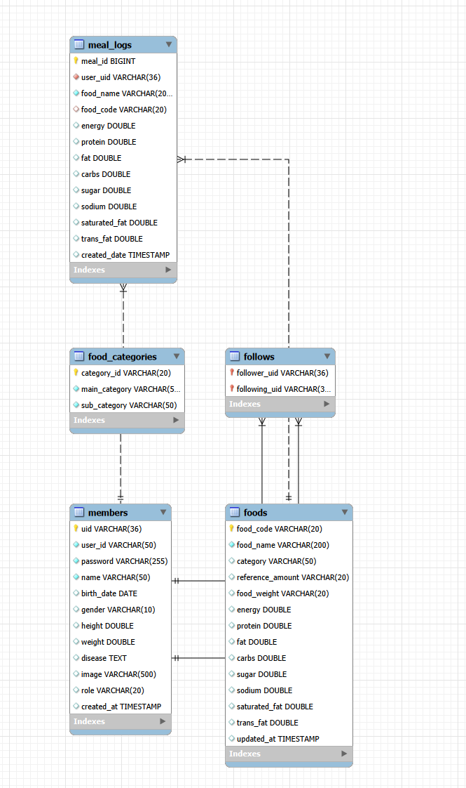

# YamYam

YamYam은 식단 기록, 음식 검색, 챌린지 관리, 회원 기능을 제공하는 웹 애플리케이션입니다. `JSP + Servlet + JDBC` 기반으로 구현되어 있으며, MySQL의 `ssafy_yumyum` 데이터베이스를 사용합니다.

## 주요 기능

- 회원가입, 로그인, 로그아웃, 마이페이지
- 팔로우 / 언팔로우
- 게시판 CRUD
- 챌린지 목록, 상세, 생성, 삭제, 구독
- 식단 기록 조회 및 작성
- 음식 DB 검색 후 선택 저장
- 직접 음식명과 영양 성분을 입력하는 식단 작성

## 기술 스택

- Java 21
- Jakarta Servlet 6
- JSP / JSTL
- MySQL 8
- HikariCP
- Lombok
- Maven

## 프로젝트 구조

- `src/main/java/com/ssafy/prj/controller` - 서블릿 컨트롤러
- `src/main/java/com/ssafy/prj/model/dao` - DB 접근 계층
- `src/main/java/com/ssafy/prj/model/dto` - 데이터 전달 객체
- `src/main/java/com/ssafy/prj/model/service` - 서비스 계층
- `src/main/java/com/ssafy/prj/util` - 공통 유틸
- `src/main/webapp/WEB-INF` - JSP 화면
- `src/main/webapp/WEB-INF/data` - 챌린지 / 음식 데이터 파일

## 데이터베이스

프로젝트는 `ssafy_yumyum` 데이터베이스를 사용합니다. 아래 테이블이 필요합니다.

- `members`
- `follows`
- `foods`
- `meal_logs`
- `food_categories`

식단 기록은 `meal_logs.user_uid -> members.uid`, `meal_logs.food_code -> foods.food_code`로 연결됩니다.

### 참고 DDL

프로젝트에 포함된 테이블 생성 스크립트를 MySQL에서 실행하세요.

```sql
CREATE DATABASE IF NOT EXISTS ssafy_yumyum;
USE ssafy_yumyum;
```

이후 `members`, `follows`, `foods`, `meal_logs`, `food_categories` 테이블을 생성합니다.


## 실행 방법

1. MySQL 8을 실행하고 `ssafy_yumyum` 데이터베이스를 생성합니다.
2. `DBUtil.java`의 접속 정보가 로컬 MySQL과 일치하는지 확인합니다.
3. Maven으로 빌드합니다.

```bash
mvn clean package
```

4. 생성된 WAR 파일을 Tomcat 10.1 이상에 배포합니다.
5. 브라우저에서 애플리케이션을 실행합니다.

## 주요 화면

- `/main` - 홈
- `/member?action=loginForm` - 로그인
- `/member?action=joinForm` - 회원가입
- `/member?action=mypage` - 마이페이지
- `/board` - 게시판
- `/challenge?action=list` - 챌린지 목록
- `/diet` - 식단 기록

## 식단 기록 사용법

1. 상단 메뉴에서 `식단 관리`를 엽니다.
2. 음식명을 검색합니다.
3. 검색 결과를 선택하면 DB의 기본 영양값이 자동 채워집니다.
4. 필요하면 음식명과 탄단지, 나트륨, 당류, 포화지방, 트랜스지방 값을 직접 수정합니다.
5. `기록 추가`를 누르면 `meal_logs`에 저장됩니다.

## 설정 파일

- `src/main/java/com/ssafy/prj/util/DBUtil.java` - DB 연결 설정
- `src/main/webapp/WEB-INF/web.xml` - 에러 페이지 설정
- `src/main/webapp/WEB-INF/common/header.jsp` - 전역 네비게이션

## 메모

- 식단 검색은 `foods` 테이블의 데이터를 사용합니다.
- 검색된 음식이 없어도 직접 입력해서 기록할 수 있습니다.
- 식단 기록은 로그인한 사용자만 사용할 수 있습니다.
